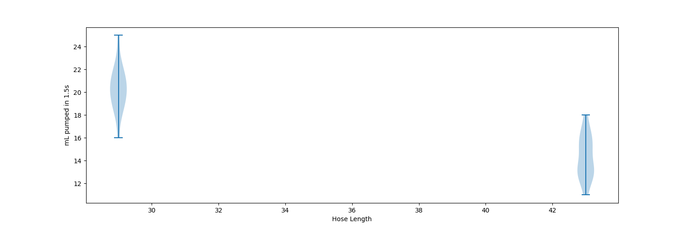

Testing the pump using DC Pin with pulse width modulation

PWM settings: frequency = 100 kHz, duty = 32768

Pump on for 1.5 seconds

Tested by pumping water into glass on digital scale - 1g water = 1 mL

