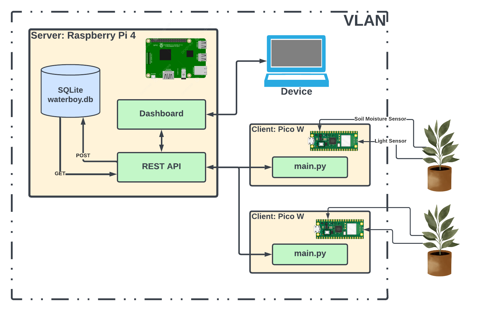

Waterboy: Distributed Houseplant Watering System with Raspberry Pi and Raspberry Pi Pico W

This is my first serious Raspberry Pi project, and my first attempt at IoT outside of work... wish me luck!

Version 0.1: Monitoring ONLY

